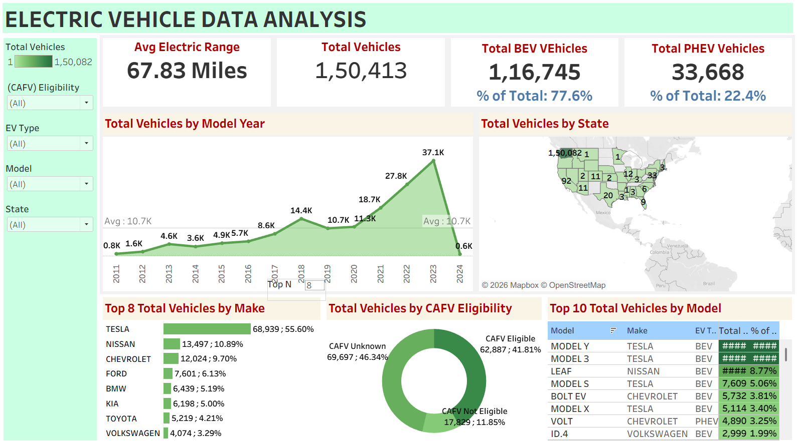
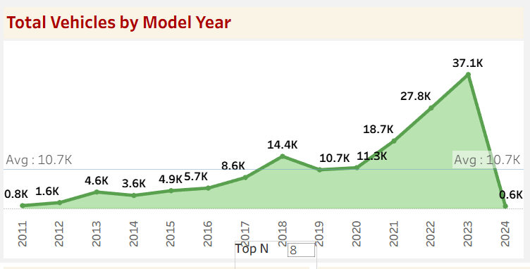
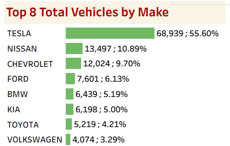

# Electric Vehicle Analysis Dashboard

This project provides insights into the adoption and distribution of electric vehicles (EVs) using Tableau.

## Project Overview
- Analyze EV adoption trends over the years.
- Identify top vehicle makes by total EVs.
- Visualize key metrics and patterns in an interactive Tableau dashboard.

## File Structure
tableau_workbook/
│
├── electric_vehicle_analysis.twbx ← Tableau workbook file
└── screenshots/ ← Screenshots of dashboards
├── dashboard_overview.png ← Overview of the dashboard
├── ev_adoption_trend_by_year.png ← Trend of EV adoption by year
└── top_8_vehicles_by_make.png ← Top 8 EVs by vehicle make

## Problem Statement
Organizations and policymakers often lack clear insights into electric vehicle (EV) adoption trends, top-performing vehicle brands, and overall market distribution.  
This limits data-driven decisions for marketing, infrastructure planning, and strategic investments in the EV sector.

## What I Implemented
- Collected and cleaned EV registration data for analysis.
- Built an interactive Tableau dashboard to visualize:
  - EV adoption trends over the years
  - Top 8 vehicle makes by total EV registrations
  - Key metrics and patterns across the EV market
- Generated clear, actionable insights for decision-making.
- Saved visualizations as screenshots for easy sharing and presentation.

## 📊 Dashboard Screenshots

### Dashboard Overview

### EV Adoption Trend by Year

### Top 8 Vehicles by Make

# Live Links

## Tableau Public – Live Interactive Dashboard
(https://public.tableau.com/app/profile/sahana.naik/viz/electric_car/Dashboard1?publish=yes)

## GitHub Repository (Tableau Workbook, Screenshots & Documentation)
(https://github.com/sahana769/Tableau-Electric-Vehicle-Data-Analysis)